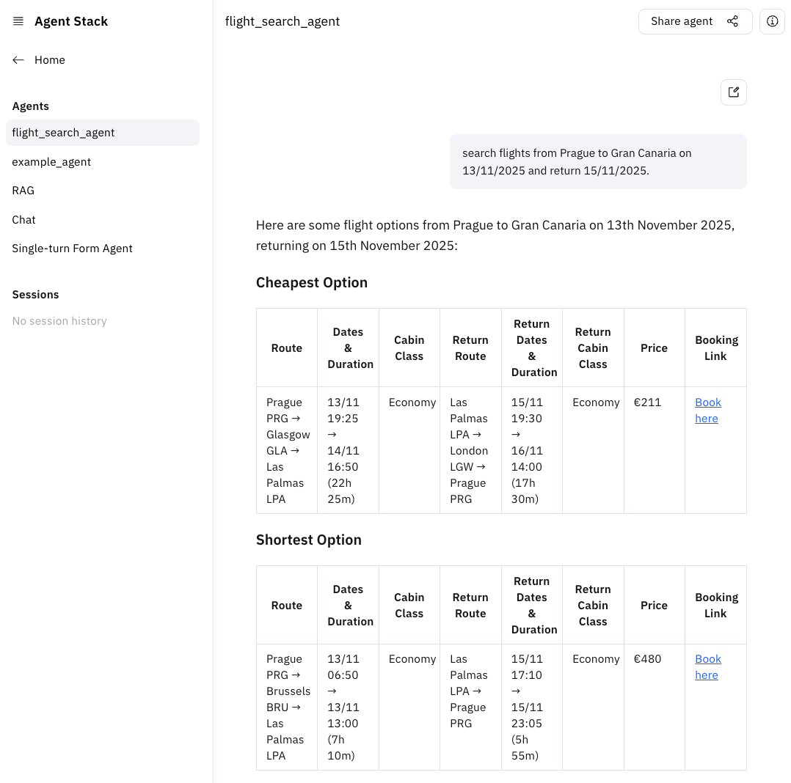

# Create flight searching agent

We will now leverage the Agent Stack LLM extension to get access to the model.

## Step 1: add LLM extension

First, rename `example_agent` to `flight_search_agent`. Then add the LLM extension using dependency injection:

```python
# Add required imports
from typing import Annotated
from agentstack_sdk.a2a.extensions import (
    LLMServiceExtensionSpec,
    LLMServiceExtensionServer,
)


@server.agent()
async def flight_search_agent(
        ...,
        # add LLM extension
        llm_ext: Annotated[
            LLMServiceExtensionServer,
            LLMServiceExtensionSpec.single_demand(suggested=("openai:gpt-4o",)),
        ],
): ...

```

In this example we will develop and test the agent with the model `openai:gpt-4o`, so we add it as one of the
suggestions. If it's available, the Agent Stack will fill in the credentials.

## Step 2. use the BeeAI framework to create an agent

To initiate a smart AI agent quickly, we can leverage
the [BeeAI framework](https://github.com/i-am-bee/beeai-framework), first install it using

```shell
uv add "beeai-framework[agentstack]"
```

Now let's create an agent and connect it to the LLM. We will initiate the kiwi MCP server too.

```python
from a2a.types import Message
from beeai_framework.adapters.agentstack.backend.chat import AgentStackChatModel
from beeai_framework.backend import ChatModelParameters
from beeai_framework.agents.requirement import RequirementAgent
from beeai_framework.agents.requirement.events import RequirementAgentFinalAnswerEvent
from beeai_framework.tools.mcp import MCPTool
from mcp.client.streamable_http import streamablehttp_client


@server.agent()
async def flight_search_agent(input: Message, llm_ext: ...):
    # Configure LLM from llm_extension
    llm = AgentStackChatModel(parameters=ChatModelParameters(stream=True))
    llm.set_context(llm_ext)

    # Create a simple prompt
    prompt = f"Search flights for the user query: {input.parts[0].root.text}"

    # Setup MCP Tool for searching flights
    client = streamablehttp_client("https://mcp.kiwi.com")
    kiwi_tools = await MCPTool.from_client(client)

    async for event, meta in RequirementAgent(llm=llm, tools=kiwi_tools).run(prompt):
        match event:
            case RequirementAgentFinalAnswerEvent(delta=delta):
                yield delta
```

Now our agent should be ready to search flights! Try running it in the UI with a flight request, for example:

```
search flights from Prague to Gran Canaria on 13/11/2025 and return 15/11/2025.
```



We are now ready for the next step! **[03-add-form](./03-add-form.md)**


