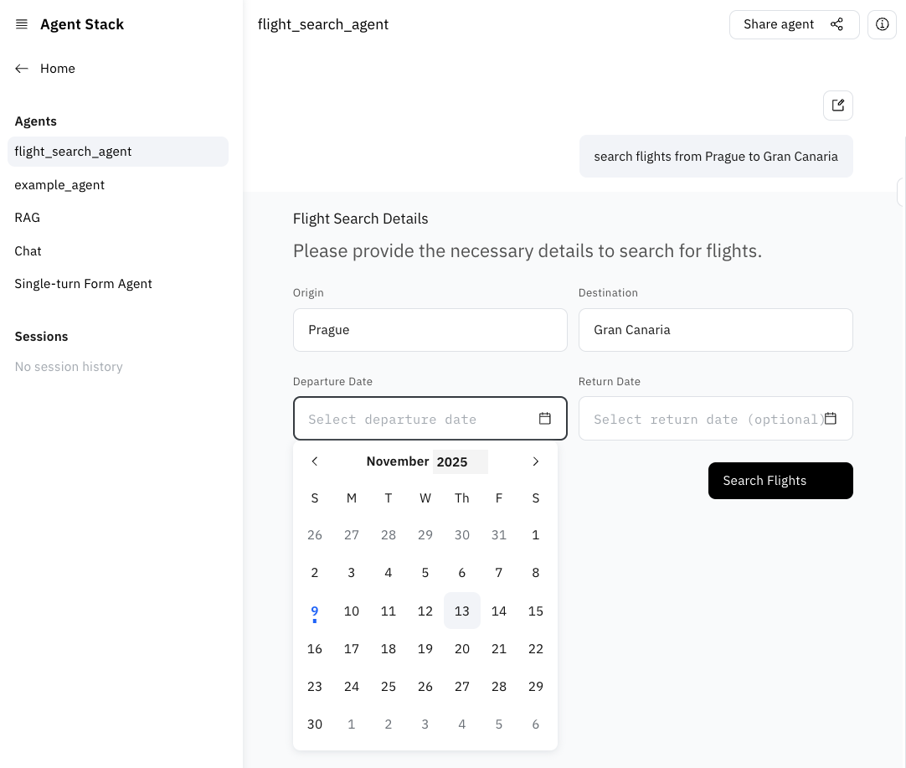

# Send interactive form to the user

We may want to process even incomplete user queries, for example ask the user for departure date when
they forgot to specify it. For this we can leverage the Agent Stack Form extension together with
smart framework tools to show a beautiful form:

```python
from typing import Annotated
from agentstack_sdk.a2a.extensions import FormExtensionServer, FormExtensionSpec, FormRender, FormResponse
from beeai_framework.tools import tool


@server.agent()
async def flight_search_agent(
        ...,
        # add form extension
        form_extension: Annotated[FormExtensionServer, FormExtensionSpec(None)],
):
    ...

    # create a framework tool to send a form to the user
    @tool
    async def ensure_all_data(form: FormRender) -> FormResponse | None:
        """
        Tool that ensures that all the required data is provided (flight dates, destination, origin, etc.).

        Args:
            form: A form that asks user for the missing inputs that are required
        Returns:
            All missing fields in a dictionary: {"start_date": ...}
        """
        return await form_extension.request_form(form=FormRender.model_validate(form))

```

The BeeAI framework will automatically infer the schema from the pydantic models provided and use the docstring
to explain the tool purpose to the LLM.

Now we can add it to the agent and make sure that it is always called as the first step:

```python
@server.agent()
async def flight_search_agent():
    ...
    async for event, meta in RequirementAgent(
            llm=llm,
            tools=[*kiwi_tools, ensure_all_data],
            requirements=[
                ConditionalRequirement(ensure_all_data, force_at_step=1),
            ],
    ).run(prompt):
        ...

```



Next, let's visualize our data! **[04-visualize-results](./04-visualize-results.md)**