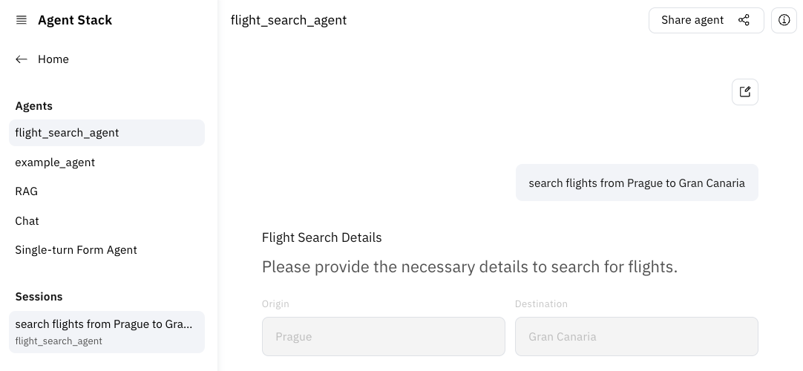

# Make visualization outputs configurable

You may have noticed that after you reload the UI or start a new chat, you will lose
the previous conversation. Let's fix that using the `PlatformContextStore`.

```python
from agentstack_sdk.server.context import RunContext
from agentstack_sdk.server.store.platform_context_store import PlatformContextStore


@server.agent()
async def flight_search_agent(input: Message, context: RunContext, ...):
    # use the RunContext to store incoming user message
    await context.store(input)

    ...
    # let's collect the output text in a `final_answer` variable
    final_answer = []
    async for event, meta in RequirementAgent(...).run(prompt):
        match event:
            case RequirementAgentFinalAnswerEvent(delta=delta):
                # save delta
                final_answer.append(delta)
                yield delta

    # Construct TextPart of the final message
    final_message = AgentMessage(parts=[TextPart(text="".join(final_answer))])

    if static_png_bytes is not None:
        base64_string = base64.b64encode(static_png_bytes).decode("utf-8")
        file_part = FilePart(file=FileWithBytes(bytes=base64_string, mime_type="image/png", name="flights.png"))

        # Add file part to final message:
        final_message.parts.append(file_part)
        yield file_part

    if interactive_html_bytes is not None:
        file = await File.create(filename="flights.html", content=interactive_html_bytes, content_type="text/html")

        # Add file part to final message:
        final_message.parts.append(file.to_file_part())
        yield file.to_file_part()

    # Store the final message
    await context.store(final_message)


def run():
    server.run(
        ...,
        # Configure Platform Context store
        context_store=PlatformContextStore(),
    )

```

The conversation should now appear in the chat history panel in the UI and you can get back to it. You can use
`context.load_history()` in the agent to fetch previous messages and pass them to the agent to continue the
conversation.



Finally, let's observe the agent behavior using Arize Phoenix in the next section:
**[07-observability](./07-observability.md)**.